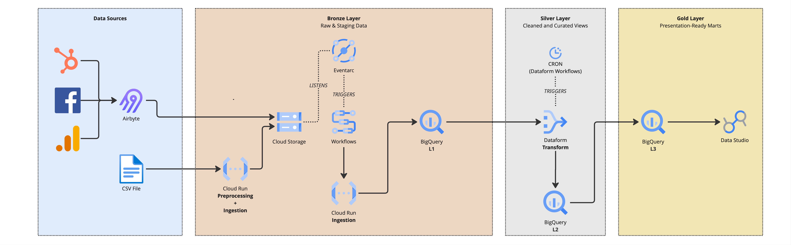

# **Data Pipeline at Near Zero Cost: A Serverless Architecture on GCP**

In the era of the Modern Data Stack, many organizations find themselves trapped between two extremes: manual, error-prone data handling or prohibitively expensive ETL (Extract, Transform, Load) platforms that demand high fixed monthly costs. The challenge for engineering teams is to build a robust, scalable system that provides business intelligence without paying for idle servers.

The following architecture demonstrates how to leverage Google Cloud Platform (GCP) to create a fully automated, serverless data pipeline. By combining event-driven ingestion with scheduled transformation, this system ensures that costs are incurred mostly during active processing, effectively driving the operational overhead to near zero for low-to-medium volume workloads.

## **1. Ingesting Data Without Always-On Infrastructure**

The entry point of the pipeline is designed around the two most common sources of business data: external platforms, such as social networks, CRMs, and analytics tools, and files uploaded manually for ad-hoc datasets:

- **External Platforms:** To extract structured data from platforms such as HubSpot, Facebook Ads, and Google Analytics, we use Airbyte, a modern ETL tool equipped with a wide range of connectors for integration with external platforms. Each sync generates a new AVRO file in GCS, so it can be stored in the lake without any additional normalization steps. The connectors run on daily cron jobs, keeping business metrics refreshed every 24 hours without requiring a persistent, always-on extraction process.
- **Files:** For files such as legacy CSVs or Excel files, we bypass heavy ETL tools. Instead, we use a Python-based Cloud Run service to perform immediate cleaning and normalization. This allows us to validate data schemas "at the edge" before the data ever touches our storage layer.

### **Landing Data in the Lake**

Both ingestion paths end in Cloud Storage (GCS). Airbyte writes ready-to-use AVRO files directly to the lake, while manually uploaded files are cleaned and normalized by Cloud Run before being stored. At this point, GCS becomes the landing layer and source of truth for the rest of the pipeline.

## **2. Orchestrating the Pipeline with Events**

Once data lands in Cloud Storage, the ingestion workflow becomes event-driven. Eventarc listens for new files and triggers the workflow that loads them into BigQuery:

- **Eventarc:** This service listens for new file creations in GCS. The moment a file is uploaded by Airbyte or Cloud Run, Eventarc triggers the ingestion workflow.
- **Google Cloud Workflows:** This is the brain of the operation. It manages the sequence of operations, retries, and conditional logic. As a managed serverless service, you pay only for the number of steps executed, not for uptime.
- **Cloud Run Ingestion:** Workflows calls a final Cloud Run service to load the validated data from the Lake into the Data Warehouse.

## **3. From Raw Data to Business-Ready Models**

Once the data is ingested, it moves through a three-layer model within BigQuery to ensure data quality, traceability, and performance.

### **The Bronze-Silver-Gold Data Warehouse Model**

- **Bronze - Staging:** Data is first loaded into BigQuery staging tables. Here, it remains close to its raw state, preserving source-level traceability and allowing us to re-process it if business logic changes without needing to re-fetch it from the original system.
- **Silver - Intermediate:** Dataform applies cleaning, joins, deduplication, and business rules using mostly views. This layer is where technical source structures are translated into consistent analytical entities, such as customers, campaigns, orders, or sessions. Since intermediate results are not directly consumed by BI users, we avoid materializing them as tables when possible, saving storage while keeping the transformation logic reusable for the presentation marts.
- **Gold - Presentation:** The final layer contains aggregated, presentation-ready tables optimized for dashboards and business users. Unlike Silver, this layer is worth materializing as tables instead of views: over time, this reduces query costs because BigQuery does not have to recalculate the full Silver transformation logic every time a dashboard refreshes. These marts hide pipeline complexity from reporting tools and expose stable, documented datasets to Data Studio and other analytics consumers.

### **Versioned SQL Transformation with Dataform**

Instead of using external transformation engines, we use Dataform. This allows us to treat our data transformations like software code using SQLX, with all transformation logic stored in a Git repository and versioned over time. Dataform manages the dependencies and execution of SQL scripts that move data from Bronze to Silver and finally to Gold. In this setup, Dataform is triggered by a cron job one hour after the Airbyte sync, giving the ingestion process enough time to complete before transformations begin.

## **4. Operational Simplicity by Design**

Beyond cost reduction, this architecture is designed to reduce the operational burden of running a data platform. There is no Airflow cluster to size, patch, or monitor, and no idle compute waiting for the next ingestion window. Each responsibility is isolated in a managed service: Cloud Run handles custom preprocessing and ingestion logic, Eventarc reacts to new files, Workflows coordinates the execution steps, BigQuery stores and processes analytical data, and Dataform manages SQL dependencies.

This separation also improves resilience and maintainability. Cloud Storage acts as a replayable source of truth, so failed loads or changed business rules can be reprocessed without calling the original APIs again. Transformations are versioned in Git, making changes reviewable and auditable. The Bronze-Silver-Gold structure creates a clear boundary between raw data, reusable business logic, and dashboard-ready marts, which keeps BI tools simple and protects business users from upstream complexity.

## **5. Why the Cost Stays Close to Zero**

The primary driver behind this architecture is cost-efficiency. By choosing these specific components, we maximize the use of GCP's free tiers and "pay-as-you-go" models:

The key principle is that every major component either scales to zero or charges only when work is performed. Cloud Run runs only during preprocessing and ingestion requests. Eventarc charges for events rather than idle listeners. Workflows charges by executed steps rather than by server uptime. Dataform runs on a schedule instead of requiring a permanent transformation worker. BigQuery separates storage from compute and charges query processing based on the amount of data scanned. For low-to-medium volume workloads, this means the platform can remain fully automated without carrying the fixed monthly cost of always-on infrastructure.

### **Real-World Cost Analysis**

| Component | Official Pricing / Free Tier | Estimated Monthly Cost |
| --- | --- | --- |
| Airbyte | ~$10/credit | ~$10.00 |
| Cloud Run | 180k vCPU-seconds free/month | $0.00 |
| Cloud Storage | First 5 GB free | <$1.00 |
| Eventarc | First 2M events free | $0.00 |
| Workflows | First 5k steps free | $0.00 |
| BigQuery | 10 GB storage / 1 TB query free | $0.00 |
| Data Studio | Standard version is free | $0.00 |
| **TOTAL** |  | **~$11.00** |

## **Conclusion**

This architecture proves that "Enterprise Grade" does not have to mean "Enterprise Price." By decoupling event-driven ingestion from scheduled transformation and replacing "always-on" servers with serverless services, we have built a pipeline that is both resilient and near zero cost to operate. The result is a system that scales automatically with the business, ensuring that your data costs never outpace your data value.